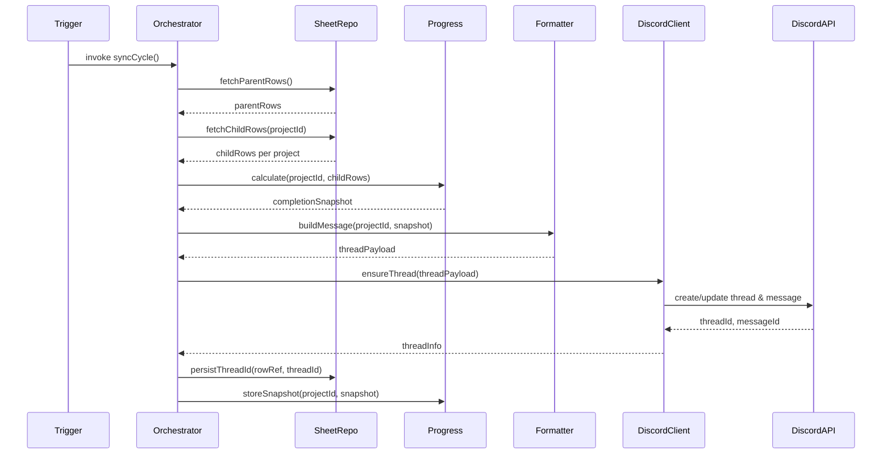
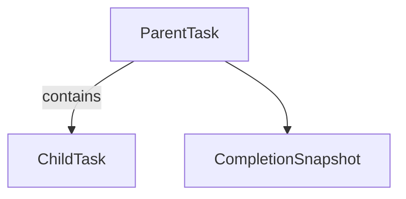

# Design Document

## Overview
byTech の TaskThreadSync Service は、本番タスク管理スプレッドシートを唯一のデータベースとして扱い、30 分毎に Discord フォーラムへ親子タスク情報を同期するバッチ機構である。本設計では、Google Apps Script の時間主導トリガーを起点に、プロジェクトID単位でスレッドを生成・更新し、子タスク進捗と完了率を可視化するためのコンポーネント境界と契約を定義する。想定ユーザは運用オーナー（全体管理）、プロジェクト管理者（スレッド管理）、チームメンバー（タスク通知の受信者）であり、通知導線を Discord に一本化することでスプレッドシート閲覧を不要にする。

### Goals
- プロジェクトID/タスクID の階層構造を正確に読み取り、整合性のある進捗データを生成する。
- Discord フォーラムスレッドの生成・再利用・完了率表示を自動化し、J 列との整合を保つ。
- 30 分間隔のバッチ同期に耐える堅牢性（リトライ、部分再送、6 分実行制限内）を確保する。

### Non-Goals
- onEdit ベースのリアルタイム同期や Slack 等他チャネルへの展開。
- Discord Bot の権限管理フローやトークン配布手順。
- Apps Script 外のワークフロー自動化（Cloud Run, Pub/Sub 等）との統合。

## Architecture

### Existing Architecture Analysis
現行リポジトリには実装が存在しないため、steering が定義する「トリガー層／サービス層／データアクセス層」の分離を初期から適用する。Google スプレッドシートを Repository 経由で操作し、Discord 連携は専用クライアントを通じて `UrlFetchApp` をカプセル化する。

### Architecture Pattern & Boundary Map
- **Selected Pattern**: レイヤード + ポート/アダプタ（Trigger → Service → Repositories/Clients）。
- **Boundaries**: `TimeTriggerOrchestrator` が唯一の公開トリガー機能、`TaskHierarchyService` がビジネスロジック境界、`SheetHierarchyRepository` / `DiscordForumClient` が外部 I/O。
- **Steering Alignment**: steering のサービス・トリガー分離、Repository 経由アクセス、通知テンプレート分割方針を順守。

#### モジュールのクロージャ実装
- Apps Script では `import` / `export` がサポートされないため、各 `src/*.js` ファイルは IIFE（即時実行関数）で依存を閉じ込め、戻り値の API をグローバル関数へ割り当てる。
- `main.js`（GAS エントリーポイント）は従来どおりトップレベル関数として公開しつつ、テストから参照できるよう `TaskThreadSync` 名前空間にも登録する。
- Node.js テストでは `module.exports` に同じ API オブジェクトを露出し、CommonJS `require` で読み込む。実行環境ごとの差を吸収することで `clasp push` でのシンタックスエラーを防ぐ。
- クロージャ内部に定数やヘルパーを保持することでグローバル汚染を避け、Apps Script でも疑似モジュール構造を維持する。

```mermaid
graph TD
  Trigger[Time Trigger (30m)] --> Orchestrator[TimeTriggerOrchestrator]
  Orchestrator --> HierarchyService[TaskHierarchyService]
  HierarchyService --> SheetRepo[SheetHierarchyRepository]
  HierarchyService --> ProgressService[ProgressSnapshotService]
  ProgressService --> PropertiesStore[PropertiesState]
  HierarchyService --> Formatter[NotificationFormatter]
  Formatter --> DiscordClient[DiscordForumClient]
  DiscordClient --> DiscordAPI[Discord Forum API]
  SheetRepo --> Sheet[Drive Spreadsheet]
```

### Technology Stack

| Layer | Choice / Version | Role in Feature | Notes |
|-------|------------------|-----------------|-------|
| Backend / Services | Google Apps Script (V8) | 時間トリガーとロジック実行 | ES2015、6 分実行制限内で動作 |
| Data / Storage | Google Sheets (本番管理シート) | 親子タスクの唯一のDB | J列=ThreadID、子タスク表と連携 |
| Messaging / Events | Discord Bot API (Threads) | スレッド作成・投稿・名前更新 | Bot Token 認証、レート制限 429 |
| Infrastructure / Runtime | Installable Time-driven Trigger (30m) | 同期サイクル起動 | `everyMinutes(30)`、±15分揺らぎ |
| State Persistence | Apps Script PropertiesService | 完了率スナップショット、再送キュー | Script Properties 500KB 制限 |
| Configuration | Config builder (JSDoc) | Script Properties の値を正規化 | 日本語メッセージとホバー説明で運用ミスを防止 |

## System Flows



## Requirements Traceability

| Requirement | Summary | Components | Interfaces | Flows |
|-------------|---------|------------|------------|-------|
| 1.1,1.2,1.3,1.4,1.5 | シート階層読み取りと完了率計算 | SheetHierarchyRepository, TaskHierarchyService, ProgressSnapshotService | `SheetRepository.fetchHierarchy`, `ProgressSnapshotService.calculate`, `PropertiesState.load` | Sync Flow |
| 2.1,2.2,2.3,2.4 | J列と Discord スレッド連携 | TimeTriggerOrchestrator, DiscordForumClient, SheetHierarchyRepository | `DiscordForumClient.ensureThread`, `SheetRepository.persistThreadId`, `ErrorReporter.log` | Sync Flow |
| 3.1,3.2,3.3,3.4 | 子タスク通知内容 | NotificationFormatter, TaskHierarchyService | `NotificationFormatter.buildMessage`, `TaskHierarchyService.diffChildren` | Sync Flow |
| 4.1,4.2,4.3,4.4,4.5 | 完了率表示と 30 分トリガー方針 | ProgressSnapshotService, DiscordForumClient | `ProgressSnapshotService.storeSnapshot`, `DiscordForumClient.updateThreadMeta` | Sync Flow |

## Components and Interfaces

### コンポーネントサマリ

| Component | Domain/Layer | Intent | Req Coverage | Key Dependencies (Criticality) | Contracts |
|-----------|--------------|--------|--------------|--------------------------------|-----------|
| TimeTriggerOrchestrator | Trigger / Service | 30 分バッチのエントリーポイント | 1.*,2.*,3.*,4.* | TaskHierarchyService (P0), Logger (P1) | Service, Batch |
| TaskHierarchyService | Service | 親子タスク読み込み・差分検出 | 1.*,3.* | SheetHierarchyRepository (P0), ProgressSnapshotService (P0), NotificationFormatter (P1) | Service |
| SheetHierarchyRepository | Data Access | スプレッドシート CRUD | 1.*,2.* | SpreadsheetApp (External P0) | Service |
| ProgressSnapshotService | State | 完了率計算とスナップショット管理 | 1.3,1.4,4.* | PropertiesService (External P1) | Service, State |
| DiscordForumClient | Integration | Discord スレッド/メッセージ API ラッパー | 2.*,3.*,4.* | Discord API (External P0) | API, Batch |
| NotificationFormatter | Service | 子タスク一覧と完了率をフォーマット | 3.*,4.* | TaskHierarchyService (Inbound P1) | Service |

### Trigger Layer

#### TimeTriggerOrchestrator

| Field | Detail |
|-------|--------|
| Intent | 30 分毎に同期サイクルを実行し、プロジェクト単位で処理を制御する |
| Requirements | 1.1-4.5 |

**Responsibilities & Constraints**
- Installable time-driven trigger（`everyMinutes(30)`）から呼び出される `syncCycle()` を公開。
- 実行時間 6 分を超えないよう、プロジェクト処理をページング（例: 50 件）し残余を次回に繰り越す。
- 例外は握りつぶさず `Logger` に構造化出力後、Apps Script 固有の失敗通知を利用。

**Dependencies**
- Inbound: Trigger (P0) — スケジュール起動。
- Outbound: TaskHierarchyService (P0) — プロジェクトごとの同期 API。
- Outbound: Logger (P1) — モニタリング。

**Contracts**: Service [x] / API [ ] / Event [ ] / Batch [x] / State [x]

##### Service Interface
```typescript
interface TimeTriggerOrchestrator {
  syncCycle(context: TriggerContext): SyncResult;
}
```
- Preconditions: トリガーが 30 分間隔で設定済み。
- Postconditions: 全処理済みプロジェクトの Thread/Properties 状態が一致。
- Invariants: 1 サイクル中に同一プロジェクトを重複処理しない。

**Implementation Notes**
- Integration: Trigger 設定関数を別途 `setupTrigger()` として提供。
- Validation: サイクル開始・終了時刻、処理件数をログに出力し、遅延検知に利用。
- Risks: 大量プロジェクトで時間超過→ `carryOverQueue` を Properties に退避。

### Service Layer

#### TaskHierarchyService

| Field | Detail |
|-------|--------|
| Intent | 親子タスクをロードし、通知用スナップショットと差分を生成する |
| Requirements | 1.1-1.5,3.1-3.4 |

**Responsibilities & Constraints**
- 親タスク行からプロジェクトID、J列参照、子タスク行集合を構築。
- `diffChildren` で前回同期からの変更を抽出。
- ProgressSnapshotService に完了率計算を依頼し、その結果を NotificationFormatter に供給。

**Dependencies**
- Outbound: SheetHierarchyRepository (P0) — 親子データ取得・J列更新。
- Outbound: ProgressSnapshotService (P0) — 完了率計算・スナップショット取得。
- Outbound: NotificationFormatter (P1) — メッセージ生成。

**Contracts**: Service [x] / API [ ] / Event [ ] / Batch [ ] / State [ ]

##### Service Interface
```typescript
interface TaskHierarchyService {
  buildProjectSnapshots(limit: number): ProjectSnapshot[];
  markThread(project: ProjectSnapshot, threadId: string): void;
}
```
- Preconditions: スプレッドシート構造（親=ProjectSheet, 子=TaskSheet）が整備済み。
- Postconditions: `ProjectSnapshot` に完全な子タスク配列と完了率が含まれる。
- Invariants: 親→子の紐付けは ProjectID で一意。

**Implementation Notes**
- Integration: 子タスク行の読み込みはフィルタ付き `getRange().getValues()` を利用。
- Validation: 必須フィールド欠落時は `validationErrors` 配列に蓄積し通知から除外。
- Risks: スプレッドシート列変更時に崩壊→列マッピングを config 化。

#### NotificationFormatter

| Field | Detail |
|-------|--------|
| Intent | Discord 投稿本文と embed を生成し、進捗率と差分を含める |
| Requirements | 3.1-3.4,4.1-4.3 |

**Responsibilities & Constraints**
- `ProjectSnapshot` を受け取り、親概要・完了率・子タスク表（Markdown or embed fields）を生成。
- 差分がある子タスクには `:warning:` 等のマーカーを付与。
- メッセージ先頭に `プロジェクトID / timestamp` を付与。

**Dependencies**
- Inbound: TaskHierarchyService (P1) — Snapshot 供給。

**Contracts**: Service [x] / API [ ] / Event [ ] / Batch [ ] / State [ ]

##### Service Interface
```typescript
interface NotificationFormatter {
  buildThreadMessage(snapshot: ProjectSnapshot): ThreadPayload;
}
```
- Preconditions: Snapshot に完了率と子タスク配列が存在。
- Postconditions: `ThreadPayload` に `content`, `embeds`, `progressLabel` が格納。

**Implementation Notes**
- Integration: Discord の 2000 文字上限を考慮し、子タスク数が多い場合は複数メッセージに分割。
- Validation: 必須フィールド欠落タスクは一覧末尾に警告欄として列挙。
- Risks: Markdown 文字列のサニタイズ漏れ。

### Data Access & State Layer

#### SheetHierarchyRepository

| Field | Detail |
|-------|--------|
| Intent | 単一シートから親/子行を抽出し、J列へのスレッドID書き込みを行う |
| Requirements | 1.1-1.3,2.2 |

**Responsibilities & Constraints**
- 単一タブ内の行を `ProjectID` でグルーピングし、最初の行を親（ThreadID 書き戻し対象）として扱う。
- 同じ `ProjectID` で `TaskID` を持つ行を子タスクとして抽出する（担当者列は存在しないため省略）。
- 書き込みは J 列へ直接行い、Apps Script の `getRange(row, column)` によるピンポイント更新を基本とする。
- バリデーション失敗時の例外メッセージは日本語で出力し、JSDoc に入出力フィールドを明記してエディタ支援を有効化する。

**Dependencies**
- External: SpreadsheetApp (P0) — 読み書き API。

**Contracts**: Service [x] / API [ ] / Event [ ] / Batch [ ] / State [ ]

##### Service Interface
```typescript
interface SheetHierarchyRepository {
  fetchParentRows(cursor?: number, limit?: number): ParentRow[];
  fetchChildRows(projectId: string): ChildRow[];
  updateThreadId(parentRowId: string, threadId: string): void;
}
```
- Preconditions: Google Drive 上の本番シート ID が設定済み。
- Postconditions: 書き込み成功時 `ThreadId` 列とローカルキャッシュが一致。

**Implementation Notes**
- Integration: 行 ID は `rowIndex` で管理し、`updateThreadId` で直接セル更新。
- Validation: Google Sheets API 失敗時は指数的リトライ 3 回。
- Risks: 手動編集による列崩れ—ヘッダ検証を実装。

#### ProgressSnapshotService

| Field | Detail |
|-------|--------|
| Intent | 完了率計算、スナップショット保存、変化検知を提供 |
| Requirements | 1.3,1.4,4.1-4.5 |

**Responsibilities & Constraints**
- `completion = doneCount / totalCount` を整数パーセントで算出。
- Script Properties に `{ projectId: { completion, total, done, updatedAt } }` を保存。
- 前回値と比較し、変化なしの場合は Discord 更新をスキップ。

**Dependencies**
- External: PropertiesService (P1) — 状態保存。

**Contracts**: Service [x] / API [ ] / Event [ ] / Batch [ ] / State [x]

##### Service Interface
```typescript
interface ProgressSnapshotService {
  calculate(children: ChildRow[]): CompletionSnapshot;
  shouldUpdate(projectId: string, snapshot: CompletionSnapshot): boolean;
  persist(projectId: string, snapshot: CompletionSnapshot): void;
}
```
- Preconditions: 子タスク配列が最新状態。
- Postconditions: `persist` 後は Properties にシリアライズ済み。

**Implementation Notes**
- Integration: JSON サイズ削減のため必要フィールドのみ保存。
- Validation: division by zero を回避し、子タスク 0 件の場合 0%。
- Risks: Properties 500KB を超える→古いエントリを LRU で削除。

### Integration Layer

#### DiscordForumClient

| Field | Detail |
|-------|--------|
| Intent | Discord フォーラムスレッドの作成・更新・メッセージ投稿を抽象化 |
| Requirements | 2.1-2.4,3.1-3.4,4.1,4.2 |

**Responsibilities & Constraints**
- `ensureThread` で J列の有無に応じて `POST /channels/{channelId}/threads` または `POST /channels/{threadId}/messages` を実行。
- スレッド名を `ProjectID | 60%` のように更新。
- 429 (rate limit) を検出してバックオフし、未送信メッセージを再実行キューに格納。

**Dependencies**
- External: Discord API (P0) — HTTPS リクエスト。
- External: PropertiesService (P2) — 再送キュー。

**Contracts**: Service [ ] / API [x] / Event [ ] / Batch [x] / State [ ]

##### API Contract
| Method | Endpoint | Request | Response | Errors |
|--------|----------|---------|----------|--------|
| POST | /channels/{forumId}/threads | `ThreadPayload` (name, message, auto_archive_duration) | Thread object (id, message) | 401,403,404,429,500 |
| POST | /channels/{threadId}/messages | `messagePayload` | Message object | 400,401,403,429 |
| PATCH | /channels/{threadId} | `{ name: string }` | Thread object | 400,403,404 |

**Implementation Notes**
- Integration: Bot Token は Script Properties で暗号化格納、HTTP ヘッダ `Authorization: Bot <token>`。
- Validation: Discord API レスポンスを JSON schema で検証し、必要フィールド欠落時にエラー化。
- Risks: フォーラムチャンネルの権限不足→初回セットアップで権限チェックツールを整備。

## Data Models

### Domain Model
- **ParentTask**: `projectId`, `title`, `owner`, `threadId`, `childTasks: ChildTask[]`, `completionSnapshot`。
- **ChildTask**: `taskId`, `projectId`, `title`, `dueDate`, `status`, `notes`, `lastUpdated`, `isComplete`。（担当者は現行シートでは保持しないためオプション扱い）
- **CompletionSnapshot**: `total`, `done`, `percentage`, `lastPostedAt`。



### Logical Data Model
- **Unified Project Sheet（1タブ構成）**
  - Columns (B〜R を使用): `B:ProjectID`, `C:ProjectTitle`, `D:担当部署`, `E:ProjectStart`, `F:ProjectDue`, `G:ProjectStatus`, `H:タグ`, `I:優先度`, `J:ThreadID`, `K:TaskID`, `L:TaskName`, `M:TaskContent`, `N:TaskStart`, `O:TaskDue`, `P:TaskStatus`, `Q:TaskCompletedAt`, `R:Notes`。
  - 親行: `TaskID` が空の行を親エントリとして扱い、同じ `ProjectID` の最初の行を J 列更新対象とする。
  - 子行: `TaskID` が入力されている行をタスクとして扱い、親と同じシート上でグルーピングする。
- **Properties Snapshot**
  - Key: `project:{ProjectID}`
  - Value: `{ total:number, done:number, percentage:number, lastPostedAt:ISO8601 }`。

### Data Contracts & Integration
- **ThreadPayload**
  - `name`: `ProjectID | <percentage>%`
  - `message.content`: Header + summary text。
  - `message.embeds[0]`: Fields `total`, `done`, `pending`, `tasks (chunked)`。
  - `auto_archive_duration`: 10080 (7d) など運用方針に従う。
- **ChangeSummary**（差分通知）
  - `taskId`
  - `changedFields`: `status`, `dueDate`
  - `previousValue`, `currentValue`
  - `marker`: `warning` / `info`

## Error Handling

### Error Strategy
- **Validation errors**: 不正データ行は通知から除外し、ログ＋Discord メッセージ末尾へ警告。
- **Integration errors**: Discord/Sheets でリトライ 3 回、継続失敗時は `ErrorReporter` に集約。
- **State errors**: Properties 保存失敗はクリティカル、即座にバッチを停止。

### Error Categories
- User/Data (4xx equivalent): 欠落列、存在しない ProjectID。
- System (5xx equivalent): Discord API 500, Apps Script サービスダウン。
- Business (422): 完了率計算不能など。→大局的に 0% として記録し警告。

### Monitoring
- `Logger.log(JSON.stringify({projectId, status, duration}))` により Stackdriver (Apps Script) で可観測化。
- Discord API 429 を捕捉した場合は `Properties` に再送予定を記録し、次回実行時に最初に処理。

## Testing Strategy
- **Unit Tests (GasTap/Jest)**
  - `ProgressSnapshotService.calculate` — 0/1/N 件ケース。
  - `NotificationFormatter.buildThreadMessage` — 差分表示と文字数分割。
  - `TaskHierarchyService.diffChildren` — 変更検出精度。
- **Integration Tests**
  - Mocked Spreadsheet + Discord stubs で `TimeTriggerOrchestrator.syncCycle` を走らせ、J列更新と API 呼び出しを検証。
  - Rate limit シナリオで DiscordForumClient のバックオフ動作を確認。
- **E2E (Manual / Staging)**
  - サンプルシートに対して 30 分トリガーを設定し、Discord サンドボックスフォーラムでスレッド生成〜更新を観察。
- **Performance**
  - 100 プロジェクト × 10 子タスク を処理し、6 分以内に完了するか測定。

## Security Considerations
- Discord Bot Token / Sheet ID は Script Properties の暗号化ストレージを利用し、リポジトリに平文で置かない。
- HTTP 通信は HTTPS のみを許可し、`UrlFetchApp` の `muteHttpExceptions` は `false` で安全側へ。
- ログには個人名やタスク本文を出力しない（ProjectID のみ）。

## Performance & Scalability
- 30 分トリガー前提で、1 サイクル当たり最大 200 API 呼び出しを上限とし、超過時は `carryOverQueue` により次回へ繰越。
- Discord 429 対策として指数バックオフ (1s, 2s, 4s) を実装し、リトライ回数上限を 3 に制限。
- Sheets 読み込みはバッチ (`getValues()` 一括) で行い、列アクセス回数を削減。
